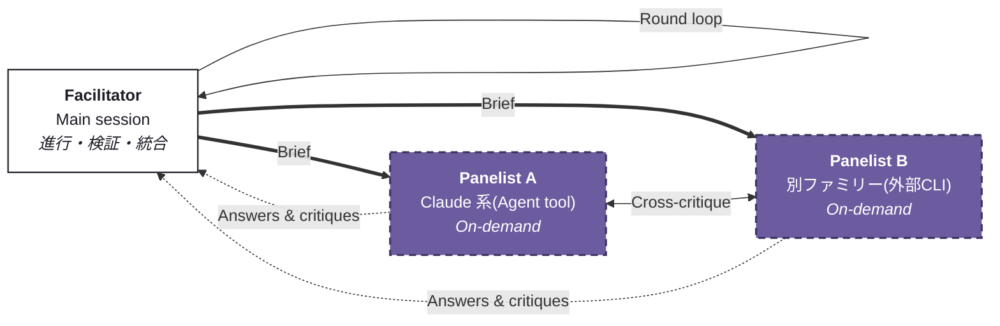
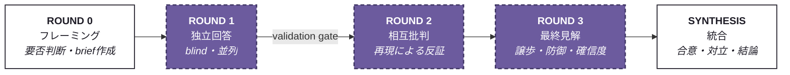

# adversarial-panel

A Claude Code skill for **multi-model adversarial mutual review** — multiple models answer independently, attack each other's answers across rounds, and a facilitator synthesizes agreements, live disagreements, and calibrated confidence into one answer.

複数のモデルが独立に回答し、ラウンド制で互いの回答を攻撃し合い、ファシリテータが合意点・対立点・較正済み確信度を統合する——GANの敵対的構造を推論時に移植した Claude Code スキルです。

## なぜ作ったか

LLMの答えがいちばん危ういのは、間違っているのに自信満々なときです。単一モデルの自己批判は、生成時と批判時の盲点が同じ重みから来ているため相関しており、しかもモデルは自分の出力を高く評価する self-preference bias を持ちます。「自分で書いて自分でレビューする」は監査としては利益相反です。

着想はGANにあります。本質は**作るより見抜く方が簡単**という検証非対称性——生成物の正しさを生成側が保証するより、独立した敵対者に攻撃させて生き残ったものだけを通す方が、同じ計算量で高い品質保証が得られます。GANはこのループを勾配で回しましたが、このスキルは**自然言語の批判**で回します。

効かせるための設計特性は2つ:

- **誤りの非相関(Decorrelation)** — 同一モデルのパネルは盲点を共有する。モデルファミリーを跨ぐことが本体。
- **検証優位(Verification advantage)** — 「怪しいと思う」ではなく「入力Xで落ちる」。断言ではなく再現で反証する。

## アーキテクチャ



ファシリテータ(メインセッション)が自己完結したbriefを配布し、パネリストは互いの回答を攻撃し合ったうえで、回答と批判をファシリテータに返します。パネリストは**異質性を最大化する順**に調達します:

1. 別モデルファミリー(Codex等の外部CLIをBash経由で)
2. 別のClaudeモデル(Agentツールの `model` パラメータ)
3. 同一モデル+強制的な方法論の分岐(第一原理/基準率/反証探索/主張の再実行)

デフォルトは **2パネリスト×3ラウンド**。コストはパネリスト数×ラウンド数に比例します。

## プロトコル



白=ファシリテータの担当、紫=パネリストの担当。

| ラウンド | 内容 |
|---|---|
| **Round 0** | パネルの要否をトリアージ(重要かつ、係争的または検証可能な問いだけ開く)。サブエージェントは会話を見られないため、反証条件の要求まで含む自己完結briefを書く |
| **Round 1** | 全パネリストをblind・並列で起動。回答が実体を伴うかの**検証ゲート**を通す(ステータス行やエラーダンプは回答ではない) |
| **Round 2** | 他者の回答を渡し、主張を引用して攻撃。検証可能な主張は再現で反証。同意の水増し・要約・賞賛は禁止 |
| **Round 3** | 自分への批判を渡し、理由をもって譲歩・防御。較正済み確信度+反証条件を要求。理由なき全面転向は追従フラグ |
| **Synthesis** | 合意点(+収束の証拠力評価)/対立点(裁定つき、両論併記は偽りのバランス)/結論(確信度・反証条件・少数意見・監査証跡) |

## 全工程で守る3つの不変条件

| 不変条件 | 内容 |
|---|---|
| **Independence** | Round 1 はblind生成。他者の回答を見たパネリストはアンカーされ、独立サンプルでなくなる |
| **Adversariality** | 新しい論拠のない同意はラウンドの失敗 |
| **No averaging** | 統合は平均ではない。対立は保存して裁定する |

## インストール

```
~/.claude/skills/adversarial-panel/SKILL.md
```

に [SKILL.md](SKILL.md) を置くだけです(Windowsは `%USERPROFILE%\.claude\skills\adversarial-panel\SKILL.md`)。

```powershell
# Windows (PowerShell)
New-Item -ItemType Directory -Force "$env:USERPROFILE\.claude\skills\adversarial-panel"
Invoke-WebRequest https://raw.githubusercontent.com/makinux/adversarial-panel/main/SKILL.md -OutFile "$env:USERPROFILE\.claude\skills\adversarial-panel\SKILL.md"
```

```bash
# macOS / Linux
mkdir -p ~/.claude/skills/adversarial-panel
curl -o ~/.claude/skills/adversarial-panel/SKILL.md https://raw.githubusercontent.com/makinux/adversarial-panel/main/SKILL.md
```

## 使い方

明示呼び出しのほか、次のような自然文でも発火します:

> 「この設計、OpusとCodexで敵対的レビューして」
> 「本当に? 議論させて確かめて」 / "red-team this" / 「セカンドオピニオンが欲しい」

重要な論点で「are you sure?」と確信を問い詰めたときも能動的に発火候補になります。向いているのは**重要で、かつ争いがあるか検証可能な問い**——アーキテクチャ選定、障害の根本原因仮説、技術予測、リサーチ結論の検証など。

## GANとの対応

| GAN(訓練時) | adversarial-panel(推論時) |
|---|---|
| 生成器 | パネリストの独立回答(Round 1) |
| 識別器 | 相互批判の攻撃側(Round 2) |
| 勾配による更新 | 自然言語の批判と、理由付きの譲歩・防御(Round 3) |
| ミニマックス均衡 | ファシリテータの裁定付き統合 |
| 識別器の優位性 | 検証非対称性——作るより見抜く方が易しい |
| 重み共有の禁止 | モデルファミリーの分離——誤りの非相関 |
| モード崩壊 | 相互同意均衡(sycophantic convergence) |

## 失敗モードと対策(すべて実運用で観測済み)

- **亡霊パネリスト** — ステータス文字列が回答として混入し、以降のラウンドが空気を相手に議論する → Round 1 直後の検証ゲート
- **追従的収束** — 新しい論拠なしの全員一致(GANのモード崩壊に相当)→「少なくとも1つの中心的主張に反対せよ」を強制
- **ファシリテータの簒奪** — 進行役が自分の意見を合議の権威でロンダリング → 見解は必ずラベル付きで分離
- **確信度の演技** — 反証条件なしの数値確信度は欠落として扱う
- **多様性の錯覚** — 同一モデルのペルソナ違いは独立レビュアーではない。「Red Team」という役名では誤りは非相関にならない

## クレジット

概念・設計: [@wayama_ryousuke](https://x.com/wayama_ryousuke)(着想はGAN、設計の壁打ちは Claude Fable 5 と実施)
