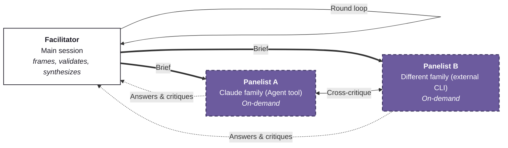
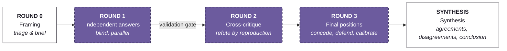

**English** | [日本語](README.ja.md)

# adversarial-panel

A Claude Code skill for **multi-model adversarial mutual review** — multiple models answer a question independently, attack each other's answers across rounds, and a facilitator synthesizes agreements, live disagreements, and calibrated confidence into one answer. The adversarial structure of GANs, transplanted to inference time.

## Why

An LLM's answer is most dangerous not when it is wrong, but when it is **confidently wrong**. Single-model self-critique cannot catch this: the blind spots at generation time and critique time come from the same weights, so they are correlated — and models demonstrably rate their own outputs higher (self-preference bias). "Write it yourself, review it yourself" is a conflict of interest posing as an audit.

The idea comes from GANs. Their essence is not the generator/discriminator pairing itself but the principle behind it: **verification is easier than generation**. Rather than having the generator vouch for its own output, let an independent adversary attack it and keep only what survives — you get a stronger quality guarantee for the same compute. GANs ran this loop with gradients; this skill runs it with **natural-language critique**.

Two design properties do the actual work — running "multiple models" as such is worth nothing:

- **Decorrelation** — reviewers only catch what the generator missed if their error modes differ. Same-model panels share blind spots, so confident convergence is weaker evidence than it looks. Crossing model families is the whole point.
- **Verification advantage** — refuting a given answer is easier than producing one. Point critics at verifiable claims: not "this seems dubious" but "this fails on input X". **Refute by reproduction, not by assertion.**

## Architecture



The facilitator (the main session) distributes a self-contained brief; panelists attack each other's answers (cross-critique) and return answers and critiques to the facilitator. Panelists are recruited in **descending order of heterogeneity**:

1. A different model family — an external CLI (e.g. Codex) via Bash
2. A different Claude model — via the Agent tool's `model` parameter
3. The same model with forced-divergent *methods* (first principles / base rates / disconfirming-evidence-only / re-executing verifiable claims) — divergent methods, not just tones

Default: **2 panelists × 3 rounds**. Cost grows as panelists × rounds.

## Protocol



White = facilitator's job, purple = panelists' job.

| Round | What happens |
|---|---|
| **Round 0** | Triage whether the panel is worth it (open it only for questions that are consequential AND contested or verifiable). Subagents see none of the conversation, so write a self-contained brief — including the demand for falsification conditions on every key claim |
| **Round 1** | Launch all panelists blind and in parallel. Pass every return through a **validation gate**: a status line or an error dump is not an answer |
| **Round 2** | Give each panelist the others' answers. Quote specific claims and attack them; refute verifiable claims by reproduction. No agreement padding, no summaries, no praise |
| **Round 3** | Give each panelist the critiques of its own answer. Concede with reasons, defend with reasons, state calibrated confidence plus a falsification condition. An unexplained full reversal is a sycophancy flag |
| **Synthesis** | Agreements (with an assessment of how much the convergence is worth) / live disagreements (adjudicated — symmetric "both views" is false balance) / conclusion (confidence, what would change it, minority opinions, audit trail) |

## Three invariants, protected throughout

| Invariant | Meaning |
|---|---|
| **Independence** | Round-1 answers are generated blind. A panelist who has seen another answer anchors on it and stops being an independent sample |
| **Adversariality** | Agreement without a new argument is a failed round |
| **No averaging** | Synthesis is not averaging. Preserve and adjudicate disagreements — splitting the difference destroys the signal |

## Installation

Drop [SKILL.md](SKILL.md) into:

```
~/.claude/skills/adversarial-panel/SKILL.md
```

(On Windows: `%USERPROFILE%\.claude\skills\adversarial-panel\SKILL.md`.)

```powershell
# Windows (PowerShell)
New-Item -ItemType Directory -Force "$env:USERPROFILE\.claude\skills\adversarial-panel"
Invoke-WebRequest https://raw.githubusercontent.com/makinux/adversarial-panel/main/SKILL.md -OutFile "$env:USERPROFILE\.claude\skills\adversarial-panel\SKILL.md"
```

```bash
# macOS / Linux
mkdir -p ~/.claude/skills/adversarial-panel
curl -o ~/.claude/skills/adversarial-panel/SKILL.md https://raw.githubusercontent.com/makinux/adversarial-panel/main/SKILL.md
```

## Usage

Besides explicit invocation, it fires on natural phrases like:

> "Adversarially review this design with Opus and Codex"
> "Are you sure? Have them debate it" / "red-team this" / "I want a second opinion"

Challenging the model's confidence ("are you sure?") on something consequential is also a proactive trigger. It is built for questions that are **consequential AND contested or verifiable** — architecture decisions, root-cause hypotheses, technical forecasts, verifying research conclusions.

## Correspondence with GANs

| GAN (training time) | adversarial-panel (inference time) |
|---|---|
| Generator | Panelists' independent answers (Round 1) |
| Discriminator | The attacking side of cross-critique (Round 2) |
| Gradient updates | Natural-language critique, reasoned concession and defense (Round 3) |
| Minimax equilibrium | Facilitator's adjudicated synthesis |
| Discriminator's advantage | Verification asymmetry — spotting flaws is easier than creating |
| No weight sharing | Model-family separation — decorrelated errors |
| Mode collapse | Mutual-agreement equilibrium (sycophantic convergence) |

## Failure modes and countermeasures (all observed in practice)

- **Ghost panelist** — a status string enters the record as an answer, and every later round debates thin air → validation gate right after Round 1
- **Sycophantic convergence** — unanimous agreement with no new arguments (the mode collapse of this setup) → force "you disagree with at least one central claim; find it"
- **Facilitator capture** — the moderator launders its own prior opinion through the panel's authority → facilitator views are always labeled and kept separate
- **Confidence theater** — a numeric confidence without a falsification condition attached is treated as missing
- **Diversity illusion** — same-model personas are not independent reviewers. A role name ("Red Team") does not decorrelate errors

## License

[MIT](LICENSE)

## Credits

Concept & design: [@wayama_ryousuke](https://x.com/wayama_ryousuke) (inspired by GANs; design refined in a back-and-forth with Claude Fable 5)
